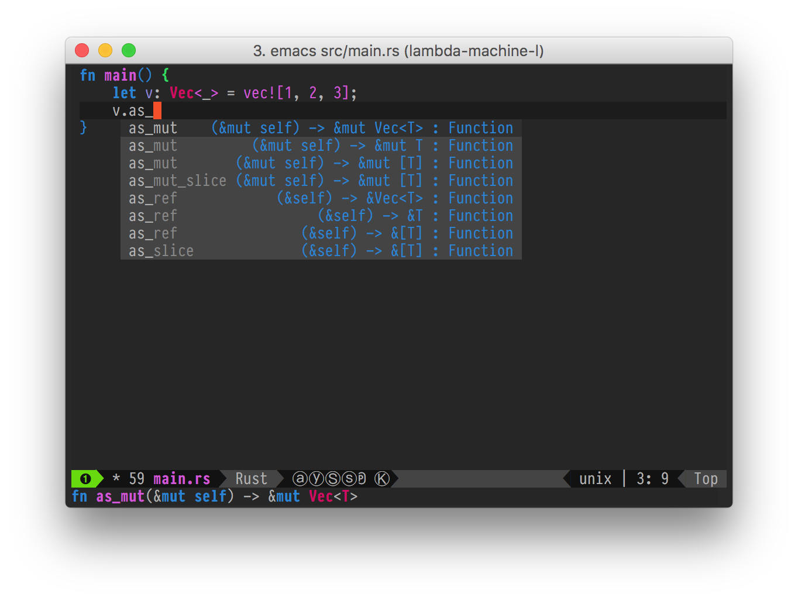

# Workspace Rust Spacemacs



## Overview

Workspace Rust Spacemacs is a docker container with [spacemacs](http://spacemacs.org) editor configured for rust development. It is based on [`workspace-rust-base`](https://github.com/rajivr/workspace-rust-base) and uses [Amazon Linux Container Image](http://docs.aws.amazon.com/AmazonECR/latest/userguide/amazon_linux_container_image.html).

**Note:** This container image is configured for personal use. Please feel free take ideas that you might find interesting. If you have questions, please open an [issue](https://github.com/rajivr/workspace-rust-spacemacs/issues).

Following tools are available &ndash;

* Rust toolchain from `workspace-rust-base`
* Emacs 24 with spacemacs and [rust](http://spacemacs.org/layers/+lang/rust/README.html) layer
* Zsh shell with [oh-my-zsh](http://ohmyz.sh/)
* Git and [StGit](https://wiki.xenproject.org/wiki/Submitting_Xen_Patches_with_StGit)
* `colordiff`

## Getting Started

You can pull docker image from Dockerhub.

```
$ docker pull rajivmr/workspace-rust-spacemacs
```

Rust requires `.cargo/` directory to be setup correctly. See [Getting Started](https://github.com/rajivr/workspace-rust-base#getting-started) section in `workspace-rust-base` for details.

```
$ cd work-rust
$ mkdir .cargo

$ docker run -d -v `pwd`:/home/ll-user/work -i rajivmr/workspace-rust-spacemacs

$ docker exec -t -i <container_name> /sbin/setuser ll-user /bin/zsh

ll-user@7d00733ed19e ~ $ emacs
```

### Building `workspace-rust-spacemacs`

```
$ cd workspace-rust-spacemacs
$ docker build -t workspace-rust-spacemacs .
```
